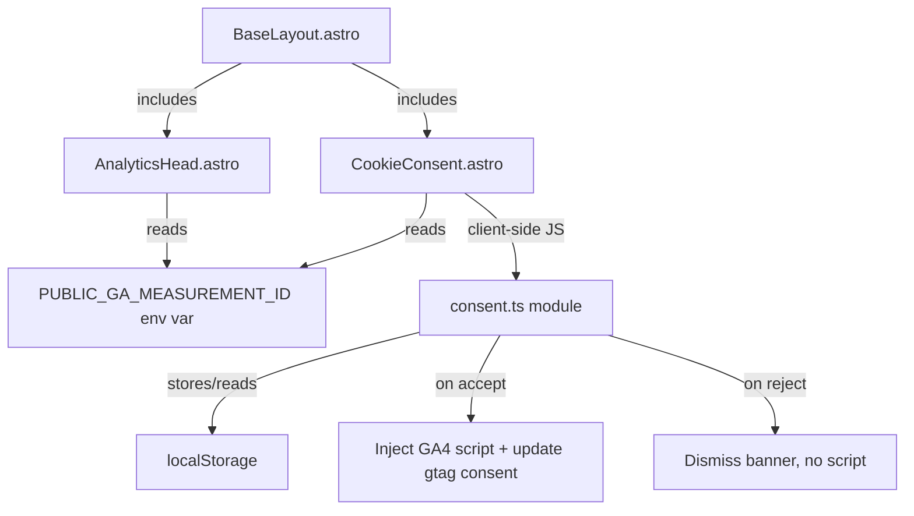

# Design Document

## Overview

This design adds Google Analytics 4 (GA4) tracking to the Warboys Gutter Clearing website with a GDPR/PECR-compliant cookie consent mechanism. The implementation consists of two new Astro components — a `CookieConsent` banner and an `AnalyticsHead` fragment — plus a small consent management module. The GA4 script is only injected when the `PUBLIC_GA_MEASUREMENT_ID` environment variable is set and the visitor has explicitly accepted analytics cookies. Consent preference is persisted in localStorage.

## Architecture



### File Structure

```
site/src/
├── components/
│   ├── AnalyticsHead.astro      # GA4 script tag (rendered in <head>)
│   ├── CookieConsent.astro      # Consent banner UI + inline script
│   └── __tests__/
│       └── cookie-consent.test.ts
├── lib/
│   ├── consent.ts               # Consent read/write helpers
│   └── __tests__/
│       └── consent.test.ts
```

## Components and Interfaces

### AnalyticsHead (`src/components/AnalyticsHead.astro`)

Rendered inside `<head>` in BaseLayout. This component handles the server-side (build-time) decision of whether to include the GA4 bootstrap code.

Responsibilities:
- Reads `PUBLIC_GA_MEASUREMENT_ID` from `import.meta.env` at build time.
- If the env var is not set, renders nothing (no script tags, no inline JS).
- If the env var is set, renders:
  1. An inline `<script>` that sets `window.dataLayer = window.dataLayer || []` and configures `gtag('consent', 'default', { analytics_storage: 'denied' })`.
  2. Does NOT load the `gtag.js` library yet — that happens client-side after consent is granted.
- Passes the measurement ID to the client via a `<meta>` tag or `data-` attribute on the script element so the client-side consent module can read it.

```astro
---
const measurementId = import.meta.env.PUBLIC_GA_MEASUREMENT_ID;
---

{measurementId && (
  <script is:inline data-measurement-id={measurementId}>
    window.dataLayer = window.dataLayer || [];
    function gtag(){dataLayer.push(arguments);}
    gtag('consent', 'default', {
      analytics_storage: 'denied'
    });
    gtag('js', new Date());
  </script>
)}
```

### CookieConsent (`src/components/CookieConsent.astro`)

Rendered at the end of `<body>` in BaseLayout, just before `</body>`.

Responsibilities:
- Only rendered when `PUBLIC_GA_MEASUREMENT_ID` is set (checked at build time in frontmatter).
- Contains the banner HTML with message, Accept button, and Reject button.
- Contains an inline `<script>` that:
  1. On page load, reads the consent preference from localStorage.
  2. If "accepted": hides the banner, loads the GA4 script.
  3. If "rejected": hides the banner, does nothing else.
  4. If no preference: shows the banner.
  5. On Accept click: stores "accepted", hides banner, loads GA4 script.
  6. On Reject click: stores "rejected", hides banner.

The "load GA4 script" action:
1. Creates a `<script>` element with `src="https://www.googletagmanager.com/gtag/js?id={measurementId}"` and `async` attribute.
2. Appends it to `<head>`.
3. Calls `gtag('consent', 'update', { analytics_storage: 'granted' })`.
4. Calls `gtag('config', measurementId)`.

### Consent Module (`src/lib/consent.ts`)

A small utility module for consent logic. Used by tests and potentially by the inline script (though the inline script may duplicate the logic for simplicity since Astro inline scripts don't support imports).

```typescript
const CONSENT_KEY = 'cookie-consent';

export type ConsentValue = 'accepted' | 'rejected';

export function getConsent(): ConsentValue | null {
  if (typeof localStorage === 'undefined') return null;
  const value = localStorage.getItem(CONSENT_KEY);
  if (value === 'accepted' || value === 'rejected') return value;
  return null;
}

export function setConsent(value: ConsentValue): void {
  localStorage.setItem(CONSENT_KEY, value);
}
```

### BaseLayout Changes

The existing `BaseLayout.astro` needs two additions:

1. In `<head>`, after the favicon link: `<AnalyticsHead />`
2. Before `</body>`, after `<StickyMobileCta />`: `<CookieConsent />`

```diff
 ---
 import Navigation from '../components/Navigation.astro';
 import StickyMobileCta from '../components/StickyMobileCta.astro';
 import Footer from '../components/Footer.astro';
+import AnalyticsHead from '../components/AnalyticsHead.astro';
+import CookieConsent from '../components/CookieConsent.astro';
 import '../styles/global.css';
 // ...
 ---
   <head>
     <!-- ... existing head content ... -->
+    <AnalyticsHead />
   </head>
   <body>
     <Navigation />
     <main><slot /></main>
     <Footer />
     <StickyMobileCta />
+    <CookieConsent />
   </body>
```

## Data Models

### Consent Storage

| Key | Storage | Values | Purpose |
|-----|---------|--------|---------|
| `cookie-consent` | localStorage | `"accepted"` \| `"rejected"` | Persists visitor's analytics consent choice |

### Environment Variables

| Variable | Scope | Format | Required |
|----------|-------|--------|----------|
| `PUBLIC_GA_MEASUREMENT_ID` | Public (client-accessible in Astro) | `G-XXXXXXXXXX` | No — feature disabled when absent |

## Correctness Properties

### Property 1: No analytics before consent

*For any* page load where the Consent_Preference is not "accepted" in localStorage, the document shall not contain a `<script>` element with `src` containing `googletagmanager.com/gtag/js`.

**Validates: Requirements 5.1, 2.7**

### Property 2: No analytics artifacts when env var is unset

*For any* build where `PUBLIC_GA_MEASUREMENT_ID` is not set, the rendered HTML shall not contain the strings `googletagmanager`, `gtag`, `dataLayer`, or the Cookie_Consent_Banner markup.

**Validates: Requirements 1.3**

### Property 3: Consent value integrity

*For any* call to `setConsent()`, the value stored in localStorage under the `cookie-consent` key shall be exactly `"accepted"` or `"rejected"` — no other value.

**Validates: Requirements 4.1, 4.2**

### Property 4: Consent buttons equal accessibility

*For any* rendering of the Cookie_Consent_Banner, the "Accept" and "Reject" buttons shall both have a minimum computed size of 44px × 44px, and both shall be keyboard-focusable.

**Validates: Requirements 3.7, 5.3**

### Property 5: GA4 consent default is denied

*For any* page where the GA4 bootstrap script is present, the inline script shall call `gtag('consent', 'default', { analytics_storage: 'denied' })` before any `gtag('config', ...)` call.

**Validates: Requirements 5.4**

## Error Handling

| Scenario | Handling |
|----------|---------|
| `PUBLIC_GA_MEASUREMENT_ID` not set | Feature entirely disabled — no banner, no scripts. Silent no-op. |
| localStorage unavailable (private browsing) | `getConsent()` returns `null`, banner shows every visit. GA4 only loads if visitor clicks Accept during that session. No errors thrown. |
| GA4 script fails to load (network error) | No impact on site functionality. Analytics simply not collected. No user-visible error. |
| Invalid value in localStorage consent key | Treated as no preference — banner shown again. `getConsent()` returns `null` for unrecognised values. |

## Testing Strategy

### Unit Tests (Example-Based)

Use Vitest for all tests.

- `consent.ts`: `getConsent()` returns null when no value stored, returns "accepted"/"rejected" for valid values, returns null for invalid values.
- `consent.ts`: `setConsent("accepted")` stores correct value, `setConsent("rejected")` stores correct value.
- Banner renders Accept and Reject buttons when measurement ID is set.
- Banner is not rendered when measurement ID is absent.
- Accept click stores "accepted" and triggers GA4 script injection.
- Reject click stores "rejected" and does not inject GA4 script.
- AnalyticsHead renders gtag consent default denied script when measurement ID is set.
- AnalyticsHead renders nothing when measurement ID is not set.

### Property-Based Tests

Use `fast-check` with Vitest. Minimum 100 iterations per property.

1. **Property 1: No analytics before consent** — Generate random consent states (null, "rejected", random strings) and verify no gtag.js script is injected.

2. **Property 3: Consent value integrity** — Generate random strings, call `setConsent()` with valid values, verify only "accepted" or "rejected" is stored. Generate random localStorage states and verify `getConsent()` only returns valid values or null.

3. **Property 4: Consent buttons equal accessibility** — Verify both buttons meet minimum size requirements across generated viewport configurations.

### Test File Structure

```
site/src/
├── lib/__tests__/
│   └── consent.test.ts           # Unit + property tests for consent module
├── components/__tests__/
│   └── cookie-consent.test.ts    # Unit tests for banner rendering logic
```
