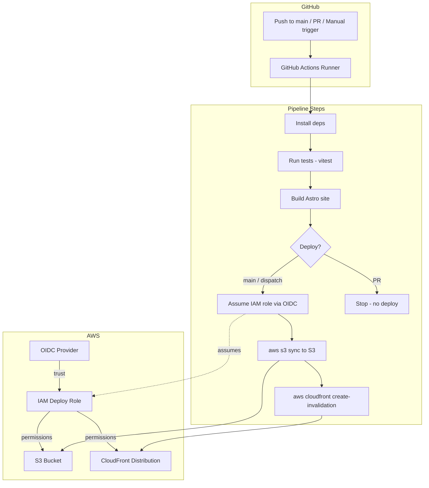

# Design Document

## Overview

This design describes a GitHub Actions CI/CD pipeline for the Warboys Gutter Clearing website. The pipeline automates the test → build → deploy cycle that is currently performed manually. It triggers on pushes to `main`, on pull requests (test + build only), and via manual `workflow_dispatch`. AWS authentication uses GitHub's OIDC provider to assume a scoped IAM role — no long-lived credentials are stored in the repository. Sensitive build-time values (Google Places API key, GA measurement ID) are injected from GitHub Secrets.

The pipeline is a single workflow file. The AWS OIDC provider and IAM role are documented as manual prerequisites (not managed by this pipeline or the existing Terraform).

## Architecture



### File Structure

```
.github/
└── workflows/
    └── deploy.yml          # The CI/CD workflow
```

No other files are created by this feature. The AWS OIDC provider and IAM role are one-time manual setup steps documented below.

## Components and Interfaces

### Workflow File (`.github/workflows/deploy.yml`)

A single GitHub Actions workflow with two jobs:

#### Job 1: `test-and-build`

Runs on all trigger events (push to main, pull request, workflow_dispatch).

Steps:
1. **Checkout** — `actions/checkout@v4`
2. **Setup Node.js** — `actions/setup-node@v4` with `node-version: 22` and `cache: npm` (cache path scoped to `site/`)
3. **Install dependencies** — `npm ci` in `site/`
4. **Run tests** — `npm test` in `site/` (runs `vitest run`)
5. **Build** — `npm run build` in `site/`, with environment variables:
   - `GOOGLE_PLACES_API_KEY` from `${{ secrets.GOOGLE_PLACES_API_KEY }}`
   - `GA_MEASUREMENT_ID` from `${{ secrets.GA_MEASUREMENT_ID }}`
6. **Upload build artifact** — `actions/upload-artifact@v4` to upload `site/dist/` for the deploy job

#### Job 2: `deploy`

Runs only on push to main and workflow_dispatch. Depends on `test-and-build` succeeding.

Condition: `if: github.event_name == 'push' || github.event_name == 'workflow_dispatch'`

Steps:
1. **Download build artifact** — `actions/download-artifact@v4`
2. **Configure AWS credentials** — `aws-actions/configure-aws-credentials@v4` with:
   - `role-to-assume: ${{ secrets.AWS_DEPLOY_ROLE_ARN }}`
   - `aws-region: eu-west-2`
   - `audience: sts.amazonaws.com`
3. **Sync to S3** — `aws s3 sync site/dist/ s3://${{ secrets.S3_BUCKET_NAME }} --delete`
4. **Invalidate CloudFront** — `aws cloudfront create-invalidation --distribution-id ${{ secrets.CLOUDFRONT_DISTRIBUTION_ID }} --paths "/*"`

### Permissions

The workflow sets top-level permissions:
```yaml
permissions:
  id-token: write   # Required for OIDC
  contents: read     # Required for checkout
```

### GitHub Secrets Required

| Secret Name | Description |
|---|---|
| `GOOGLE_PLACES_API_KEY` | Google Places API key for build-time review fetching |
| `GA_MEASUREMENT_ID` | Google Analytics measurement ID |
| `AWS_DEPLOY_ROLE_ARN` | ARN of the IAM role to assume via OIDC |
| `S3_BUCKET_NAME` | Name of the S3 bucket (e.g. `warboysgutterclearing-website`) |
| `CLOUDFRONT_DISTRIBUTION_ID` | CloudFront distribution ID for cache invalidation |

### AWS OIDC Setup (Manual Prerequisites)

These are one-time setup steps performed outside the pipeline:

1. **Create OIDC Identity Provider in AWS IAM:**
   - Provider URL: `https://token.actions.githubusercontent.com`
   - Audience: `sts.amazonaws.com`

2. **Create IAM Deploy Role** with trust policy:
```json
{
  "Version": "2012-10-17",
  "Statement": [
    {
      "Effect": "Allow",
      "Principal": {
        "Federated": "arn:aws:iam::ACCOUNT_ID:oidc-provider/token.actions.githubusercontent.com"
      },
      "Action": "sts:AssumeRoleWithWebIdentity",
      "Condition": {
        "StringEquals": {
          "token.actions.githubusercontent.com:aud": "sts.amazonaws.com"
        },
        "StringLike": {
          "token.actions.githubusercontent.com:sub": "repo:neil3k/gutter_website:ref:refs/heads/main"
        }
      }
    }
  ]
}
```

3. **Attach inline policy** to the role:
```json
{
  "Version": "2012-10-17",
  "Statement": [
    {
      "Sid": "S3Deploy",
      "Effect": "Allow",
      "Action": [
        "s3:PutObject",
        "s3:DeleteObject",
        "s3:ListBucket"
      ],
      "Resource": [
        "arn:aws:s3:::warboysgutterclearing-website",
        "arn:aws:s3:::warboysgutterclearing-website/*"
      ]
    },
    {
      "Sid": "CloudFrontInvalidation",
      "Effect": "Allow",
      "Action": "cloudfront:CreateInvalidation",
      "Resource": "arn:aws:cloudfront::ACCOUNT_ID:distribution/DISTRIBUTION_ID"
    }
  ]
}
```

### Terraform CloudFront Distribution ID Output

The existing Terraform outputs do not expose the CloudFront distribution ID (only the domain name and ARN). A new output should be added to `infra/modules/cloudfront/outputs.tf` and `infra/outputs.tf` to make the distribution ID available:

```hcl
# infra/modules/cloudfront/outputs.tf
output "distribution_id" {
  description = "ID of the CloudFront distribution"
  value       = aws_cloudfront_distribution.this.id
}

# infra/outputs.tf
output "cloudfront_distribution_id" {
  description = "ID of the CloudFront distribution (needed for cache invalidation)"
  value       = module.cloudfront.distribution_id
}
```

This is a Terraform change but is a prerequisite for the pipeline — the developer needs the distribution ID value to populate the `CLOUDFRONT_DISTRIBUTION_ID` GitHub Secret.

## Data Models

No new data models are introduced. The pipeline operates on existing build artifacts and AWS resources.

## Correctness Properties

### Property 1: Deploy jobs never run on pull requests

*For any* workflow run triggered by a `pull_request` event, the deploy job (S3 sync and CloudFront invalidation) shall not execute.

**Validates: Requirement 2.2**

### Property 2: Test failure blocks deployment

*For any* workflow run where the test step exits with a non-zero code, the build and deploy steps shall not execute.

**Validates: Requirement 1.3**

### Property 3: No long-lived AWS credentials in secrets

*For any* version of the workflow file, the workflow shall not reference `AWS_ACCESS_KEY_ID` or `AWS_SECRET_ACCESS_KEY` as environment variables or secret references.

**Validates: Requirement 4.2**

### Property 4: OIDC permissions are declared

*For any* version of the workflow file, the top-level `permissions` block shall include `id-token: write`.

**Validates: Requirement 4.1**

### Property 5: Secrets are not echoed

*For any* step in the workflow file, the `run` commands shall not contain `echo` statements that reference `secrets.GOOGLE_PLACES_API_KEY`, `secrets.GA_MEASUREMENT_ID`, `secrets.AWS_DEPLOY_ROLE_ARN`, `secrets.S3_BUCKET_NAME`, or `secrets.CLOUDFRONT_DISTRIBUTION_ID`.

**Validates: Requirement 5.4**

### Property 6: S3 sync uses --delete flag

*For any* deploy execution, the S3 sync command shall include the `--delete` flag to remove stale files from the bucket.

**Validates: Requirement 6.1**

## Error Handling

| Scenario | Handling |
|---|---|
| Test suite fails | Pipeline stops. Deploy job does not run. GitHub reports failed check. |
| Build fails | Pipeline stops. Deploy job does not run. GitHub reports failed check. |
| OIDC role assumption fails | Deploy job fails. GitHub reports failed check. Developer checks IAM trust policy and OIDC provider config. |
| S3 sync fails | Deploy job fails at sync step. CloudFront invalidation does not run. GitHub reports failed check. |
| CloudFront invalidation fails | Deploy job fails at invalidation step. Site content is updated in S3 but edge caches may serve stale content until TTL expires. Developer can re-run the workflow. |
| Missing GitHub Secret | The step referencing the secret receives an empty string. Build may succeed without API key (falls back to hardcoded testimonials). Deploy will fail if AWS role ARN or bucket name is empty. |

## Testing Strategy

### Static Analysis of Workflow File

The workflow YAML can be validated using `actionlint` or similar tools. This is a manual/optional step — the primary validation is that the workflow runs successfully on GitHub Actions.

### Integration Testing

The pipeline itself is tested by running it:
- Push to a feature branch and open a PR → verify tests run, build succeeds, no deploy occurs.
- Merge to main → verify full pipeline runs: tests, build, S3 sync, CloudFront invalidation.
- Trigger manual dispatch → verify identical behaviour to push-to-main.

### Property-Based Tests

The correctness properties defined above are structural properties of the YAML file and can be verified by parsing the workflow file and asserting on its structure. These tests use Vitest and read the YAML file directly.

**Test file:** `site/src/lib/__tests__/workflow-validation.test.ts`

Tests:
1. Parse `.github/workflows/deploy.yml` and verify the deploy job has a condition excluding `pull_request` events.
2. Verify the workflow does not contain references to `AWS_ACCESS_KEY_ID` or `AWS_SECRET_ACCESS_KEY`.
3. Verify the `permissions` block includes `id-token: write`.
4. Verify no `run` step contains `echo` with a secret reference.
5. Verify the S3 sync command includes `--delete`.
6. Verify no step runs `terraform` commands.
