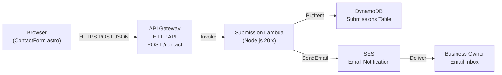

# Design Document: Contact Form Backend

## Overview

This design describes a serverless backend for the Warboys Gutter Clearing contact form. The system receives form submissions via an AWS API Gateway HTTP API, validates them in a Lambda function, stores valid submissions in DynamoDB, and sends email notifications to the business owner via SES. A honeypot field provides spam protection. All infrastructure is provisioned as Terraform modules alongside the existing S3/CloudFront/ACM/DNS setup.

The frontend `ContactForm.astro` component already POSTs JSON to a configurable endpoint. This backend provides that endpoint and adds a hidden honeypot field to the form for bot detection.

## Architecture



Request flow:
1. Visitor fills in the contact form and submits. The browser POSTs JSON (including the honeypot field) to the API Gateway endpoint.
2. API Gateway applies rate limiting (10 req/s, burst 20) and CORS policy, then invokes the Lambda.
3. Lambda checks the honeypot field — if non-empty, returns 200 silently (no store, no email).
4. Lambda validates required fields (name, email, telephone, address). Returns 400 with field errors on failure.
5. Lambda writes the submission to DynamoDB (UUID partition key, ISO 8601 sort key).
6. Lambda sends an email notification via SES. If SES fails, the error is logged but the visitor still gets a 200 response (the record is already persisted).
7. Lambda returns `{"message": "Submission received"}` with HTTP 200.

## Components and Interfaces

### Terraform Modules

Four new modules under `infra/modules/`:

| Module | Purpose | Key Resources |
|---|---|---|
| `api-gateway` | HTTP API, POST /contact route, CORS, rate limiting, Lambda integration | `aws_apigatewayv2_api`, `aws_apigatewayv2_stage`, `aws_apigatewayv2_route`, `aws_apigatewayv2_integration` |
| `lambda` | Submission Lambda function, IAM role, CloudWatch log group | `aws_lambda_function`, `aws_iam_role`, `aws_iam_role_policy`, `aws_cloudwatch_log_group` |
| `dynamodb` | Submissions table | `aws_dynamodb_table` |
| `ses` | Verified sender email identity | `aws_ses_email_identity` |

### Root Module Wiring (`infra/main.tf`)

New module blocks are added after the existing DNS module:

```hcl
module "dynamodb"    { source = "./modules/dynamodb" }
module "ses"         { source = "./modules/ses"         sender_email = var.ses_sender_email }
module "lambda"      { source = "./modules/lambda"      table_name = module.dynamodb.table_name, table_arn = module.dynamodb.table_arn, ses_sender_email = var.ses_sender_email, notify_email = var.notify_email }
module "api_gateway" { source = "./modules/api-gateway"  lambda_invoke_arn = module.lambda.invoke_arn, lambda_function_name = module.lambda.function_name, domain_name = var.domain_name }
```

New root variables: `notify_email` (business owner recipient), `ses_sender_email` (SES verified sender).
New root output: `contact_api_endpoint_url` — the full URL including `/contact` path.

### Lambda Handler (`infra/lambda/contact-form/index.mjs`)

Single ESM file, no bundler needed. Uses AWS SDK v3 clients (`@aws-sdk/client-dynamodb`, `@aws-sdk/client-ses`) which are available in the Lambda Node.js 20.x runtime.


**Handler interface:**

```javascript
// Environment variables read by the handler:
// TABLE_NAME       — DynamoDB table name
// NOTIFY_EMAIL     — business owner email (recipient)
// SES_SENDER_EMAIL — verified SES sender address

export async function handler(event) {
  // event.body is the JSON string from API Gateway
  // Returns: { statusCode, headers, body }
}
```

**Internal functions (all in the same file):**

| Function | Signature | Purpose |
|---|---|---|
| `parseBody` | `(event) → object` | JSON-parses `event.body`, returns parsed object or throws |
| `isSpam` | `(body) → boolean` | Returns `true` if `body.honeypot` is a non-empty string |
| `validate` | `(body) → { valid, errors }` | Checks required fields, email format; returns list of invalid field names |
| `storeSubmission` | `(item) → Promise<void>` | DynamoDB `PutItem` with UUID + ISO timestamp |
| `sendNotification` | `(item) → Promise<void>` | SES `SendEmail` to business owner |

### Frontend Changes (`ContactForm.astro`)

Minimal changes to the existing component:
1. Add a honeypot `<input>` field with `name="honeypot"`, hidden via CSS (`position: absolute; left: -9999px; opacity: 0`), with `aria-hidden="true"` and `tabindex="-1"`.
2. Include the honeypot value in the JSON payload sent by the existing `fetch` call.
3. The `PUBLIC_FORM_ACTION_URL` env var is already read — no change needed there.

## Data Models

### Submission Payload (Browser → API Gateway)

```json
{
  "name": "string (required)",
  "email": "string (required, email format)",
  "telephone": "string (required)",
  "address": "string (required)",
  "message": "string (optional)",
  "honeypot": "string (should be empty for real users)"
}
```

### DynamoDB Submissions Table

| Attribute | Type | Key | Description |
|---|---|---|---|
| `id` | String | Partition key | UUIDv4 generated by Lambda |
| `submittedAt` | String | Sort key | ISO 8601 timestamp (`new Date().toISOString()`) |
| `name` | String | — | Submitter name |
| `email` | String | — | Submitter email |
| `telephone` | String | — | Submitter telephone |
| `address` | String | — | Submitter address |
| `message` | String | — | Message body, empty string if not provided |

Billing mode: on-demand (PAY_PER_REQUEST). No GSIs needed — the table is write-heavy with infrequent reads (business owner checks DynamoDB console or uses CLI).

### SES Notification Email

- **From:** `SES_SENDER_EMAIL` (Terraform variable, verified identity)
- **To:** `NOTIFY_EMAIL` (Terraform variable, business owner)
- **Subject:** `New Contact Form Submission from {name}`
- **Body (text):**

```
New contact form submission:

Name:      {name}
Email:     {email}
Telephone: {telephone}
Address:   {address}
Message:   {message}

Submitted at: {submittedAt}
```

### API Gateway Responses

| Scenario | Status | Body |
|---|---|---|
| Valid submission (or honeypot detected) | 200 | `{"message": "Submission received"}` |
| Validation failure | 400 | `{"message": "Validation failed", "errors": ["name", "email"]}` |
| Internal error | 500 | `{"message": "Internal server error"}` |
| Rate limit exceeded | 429 | (API Gateway default throttle response) |

### Terraform Variables (new)

| Variable | Type | Description |
|---|---|---|
| `notify_email` | `string` | Business owner email address (notification recipient) |
| `ses_sender_email` | `string` | SES verified sender email address |

### Terraform Outputs (new)

| Output | Value | Description |
|---|---|---|
| `contact_api_endpoint_url` | `"${module.api_gateway.api_endpoint}/contact"` | Full endpoint URL for `PUBLIC_FORM_ACTION_URL` |


## Correctness Properties

*A property is a characteristic or behavior that should hold true across all valid executions of a system — essentially, a formal statement about what the system should do. Properties serve as the bridge between human-readable specifications and machine-verifiable correctness guarantees.*

### Property 1: Validation rejects incomplete payloads and lists all invalid fields

*For any* submission payload where at least one required field (name, email, telephone, address) is missing, empty, or whitespace-only, or where the email field does not match a standard email format, the Lambda `validate` function shall return `{ valid: false }` with an `errors` array containing exactly the names of all invalid fields.

**Validates: Requirements 1.5, 3.1, 3.2, 3.3, 3.4, 3.6**

### Property 2: Honeypot silently discards spam without side effects

*For any* submission payload where the `honeypot` field is a non-empty string, the Lambda handler shall return HTTP 200 with `{"message": "Submission received"}`, shall not call DynamoDB PutItem, and shall not call SES SendEmail.

**Validates: Requirements 4.3, 4.4, 4.5**

### Property 3: Valid submission stores a complete record in DynamoDB

*For any* valid, non-spam submission payload (all required fields present and valid, honeypot empty), the Lambda handler shall call DynamoDB PutItem with an item containing: a `id` field matching UUID v4 format, a `submittedAt` field matching ISO 8601 format, and `name`, `email`, `telephone`, `address` fields matching the input values, and a `message` field equal to the input message or an empty string if the message was not provided.

**Validates: Requirements 6.3, 6.4, 3.5**

### Property 4: Valid submission sends a correct notification email

*For any* valid, non-spam submission payload, the Lambda handler shall call SES SendEmail with: the configured sender address as the source, the configured business owner email as the destination, a subject line containing the submitter's name, and a body containing the values of name, email, telephone, address, and message.

**Validates: Requirements 7.1, 7.2, 7.3, 7.4**

### Property 5: Valid submission returns success response

*For any* valid, non-spam submission payload, the Lambda handler shall return HTTP status code 200 with a JSON body containing `{"message": "Submission received"}`.

**Validates: Requirements 1.4**

## Error Handling

| Scenario | Behaviour | Response to Visitor |
|---|---|---|
| Malformed JSON body | Lambda catches parse error | 400 `{"message": "Invalid request body"}` |
| Missing/invalid required fields | `validate` returns errors list | 400 `{"message": "Validation failed", "errors": [...]}` |
| Honeypot triggered | Silent discard, no store/email | 200 `{"message": "Submission received"}` |
| DynamoDB PutItem fails | Lambda logs error, does not attempt SES | 500 `{"message": "Internal server error"}` |
| SES SendEmail fails | Lambda logs error, submission already stored | 200 `{"message": "Submission received"}` (Req 7.6) |
| Rate limit exceeded | API Gateway handles before Lambda | 429 (API Gateway default) |

Design rationale for SES failure tolerance (Req 7.6): The DynamoDB write happens before the SES call. If the email fails, the submission is already persisted, so the visitor should not see an error. The business owner can check DynamoDB directly. The error is logged to CloudWatch for operational visibility.

## Testing Strategy

### Unit Tests

Unit tests cover specific examples, edge cases, and error conditions:

- **Lambda handler:** Valid submission happy path, missing individual fields, malformed JSON, honeypot detection, SES failure resilience (Req 7.6), DynamoDB failure returns 500
- **`validate` function:** Empty string vs whitespace-only vs undefined for each field, various invalid email formats, valid email edge cases
- **`isSpam` function:** Empty honeypot returns false, whitespace honeypot returns true, non-empty honeypot returns true
- **`parseBody` function:** Valid JSON, invalid JSON, missing body
- **Frontend honeypot:** ContactForm.astro renders the honeypot field with correct attributes (`aria-hidden`, `tabindex="-1"`, hidden CSS)

### Property-Based Tests

Property-based tests use `fast-check` (already a dev dependency in the project) to verify universal properties across randomly generated inputs. Each property test runs a minimum of 100 iterations.

Each test is tagged with a comment referencing the design property:

```
// Feature: contact-form-backend, Property {N}: {title}
```

| Property | Generator Strategy | Assertion |
|---|---|---|
| Property 1: Validation rejects incomplete payloads | Generate payloads with random combinations of missing/empty/whitespace required fields and invalid email formats | `validate` returns `valid: false` with correct `errors` array |
| Property 2: Honeypot discards spam | Generate valid payloads with random non-empty honeypot strings | Handler returns 200, DynamoDB mock not called, SES mock not called |
| Property 3: Valid submission stores complete record | Generate fully valid payloads (with and without optional message) | DynamoDB PutItem called with item containing UUID id, ISO timestamp, and all field values; message defaults to `""` |
| Property 4: Valid submission sends correct email | Generate fully valid payloads | SES SendEmail called with correct source, destination, subject containing name, body containing all field values |
| Property 5: Valid submission returns success | Generate fully valid payloads | Handler returns `{ statusCode: 200, body: '{"message":"Submission received"}' }` |

Properties 3, 4, and 5 share the same generator (valid non-spam payloads) and can be combined into a single test that asserts all three aspects, or kept separate for clarity. The design recommends keeping them separate so that failures pinpoint the exact concern.

### Test File Locations

- Lambda handler tests: `infra/lambda/contact-form/__tests__/handler.test.mjs`
- Frontend honeypot tests: added to existing `site/src/components/__tests__/` or `site/src/lib/__tests__/`

### Test Configuration

- Framework: Vitest (already configured in the project)
- PBT library: fast-check (already a dev dependency)
- Minimum iterations per property test: 100
- Lambda tests mock the AWS SDK clients (DynamoDB and SES) to avoid real AWS calls

