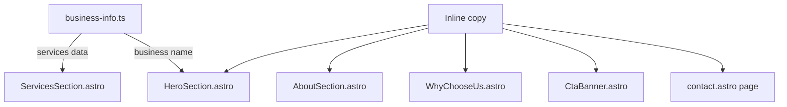
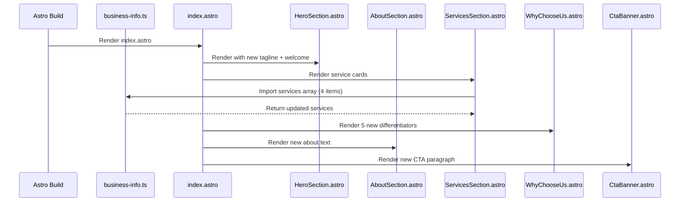

# Design Document: Content Updates

## Overview

Update the textual content across the Warboys Gutter Clearing Astro website to match the new brand copy provided by the business owner. This involves modifying the hero section, about section, services section, "Why Choose Us" section, CTA banner, and contact page with refreshed messaging that emphasises the family-run, local, and reliable nature of the business. A new fourth service card ("Domestic & Small Commercial Properties") is added, and the services data file is updated to include a "Gutter Guard Installation" entry alongside the existing three.

## Architecture

The site follows a component-based Astro architecture where static `.astro` components render content from a centralised `business-info.ts` data file and inline text. Content updates touch both the data layer and the presentation layer.



## Components and Interfaces

### Data Layer: `site/src/data/business-info.ts`

Update the `services` array to reflect the new service descriptions and add a fourth service entry.

```typescript
// Updated services array
services: [
  {
    name: "Gutter Clearing",
    description:
      "Using a powerful professional gutter vacuum system — safe, efficient, and no need for ladders in most cases.",
  },
  {
    name: "Gutter Guard Installation",
    description:
      "To help prevent blockages and reduce future maintenance.",
  },
  {
    name: "Downpipe Clearing & Minor Maintenance",
    description:
      "Clearing blocked downpipes and minor gutter repairs to restore proper drainage and protect your property.",
  },
  {
    name: "Domestic & Small Commercial Properties",
    description:
      "We serve both domestic homes and small commercial properties across Warboys and the surrounding areas.",
  },
]
```

### Component: `HeroSection.astro`

Add a tagline and welcome paragraph beneath the existing heading.

Current heading: `"Blocked Gutters? We Clear Them Fast."`

New content to add below the heading:
- Tagline: `"Local. Reliable. Family Run."`
- Welcome text: `"Welcome to Warboys Gutter Clearing — your trusted local experts for keeping gutters clean, clear, and working as they should."`

```typescript
// New elements inserted after <h1>
// <p class="hero__tagline">Local. Reliable. Family Run.</p>
// <p class="hero__welcome">Welcome to Warboys Gutter Clearing — ...</p>
```

### Component: `AboutSection.astro`

Replace the existing about paragraph with the new copy.

```typescript
// New about text (replaces existing paragraph)
const aboutText = `We're a friendly, family-run business with years of experience serving Warboys and the surrounding areas. We take pride in offering a reliable, professional service with a personal touch — no fuss, no mess, just the job done properly.`;
```

### Component: `ServicesSection.astro`

Update to render 4 service cards matching the new service list. The card descriptions come from the updated `business-info.ts` data, but the component currently uses hardcoded cards. The component will be updated to reflect the 4 new services with their descriptions.

### Component: `WhyChooseUs.astro`

Replace the current 5 differentiator items with the new 5 items:
1. Family-run and well established
2. Friendly, honest, and reliable
3. Local to Warboys — we care about our community
4. Fully insured for your peace of mind
5. Modern equipment for a thorough clean every time

### Component: `CtaBanner.astro`

Update the CTA text to include the new paragraph:

```typescript
// New CTA paragraph (replaces or supplements existing text)
const ctaText = `Whether your gutters are overflowing, blocked with moss and leaves, or you just want to stay on top of maintenance, we're here to help.`;
// Existing "Get in touch today for a free, no-obligation quote." remains as secondary line
```

### Page: `contact.astro`

Update the intro paragraph on the contact page with the new "Get in Touch" copy:

```typescript
// New contact intro text
const contactIntro = `Contact us today for a free quote and let us take care of your gutters — quickly, safely, and professionally.`;
```

## Data Models

No new data models are introduced. The existing `ServiceInfo` and `BusinessInfo` interfaces remain unchanged. The `services` array gains one additional entry (from 3 to 4 items).

```typescript
// Existing interface — no changes needed
interface ServiceInfo {
  name: string;
  description: string;
}
```

## Sequence Diagrams

### Content Rendering Flow



## Key Functions with Formal Specifications

### Function: renderServiceCards()

```typescript
// ServicesSection renders cards from the services data
function renderServiceCards(services: ServiceInfo[]): HTMLElement[]
```

**Preconditions:**
- `services` is a non-empty array of `ServiceInfo` objects
- Each service has a non-empty `name` and `description`

**Postconditions:**
- Returns exactly `services.length` card elements
- Each card displays the service `name` as heading and `description` as paragraph
- Cards are rendered in array order

### Function: renderWhyChooseUsItems()

```typescript
// WhyChooseUs renders the 5 differentiator items
function renderWhyChooseUsItems(items: string[]): HTMLElement[]
```

**Preconditions:**
- `items` is an array of exactly 5 non-empty strings

**Postconditions:**
- Returns exactly 5 list item elements
- Each item displays the corresponding string as its title
- Items maintain their original order

## Example Usage

```typescript
// After updates, the services data will contain:
import { businessInfo } from '../data/business-info';

console.log(businessInfo.services.length); // 4
console.log(businessInfo.services[0].name); // "Gutter Clearing"
console.log(businessInfo.services[1].name); // "Gutter Guard Installation"
console.log(businessInfo.services[2].name); // "Downpipe Clearing & Minor Maintenance"
console.log(businessInfo.services[3].name); // "Domestic & Small Commercial Properties"
```

## Correctness Properties

*A property is a characteristic or behavior that should hold true across all valid executions of a system — essentially, a formal statement about what the system should do. Properties serve as the bridge between human-readable specifications and machine-verifiable correctness guarantees.*

Note: This feature consists entirely of static content updates to Astro templates and a fixed data file. All acceptance criteria are best validated through example-based content assertions rather than property-based tests, since there are no pure functions with variable input, no parsers/serializers, and no algorithmic logic. The correctness checks below are example-based assertions verified by reading component source or importing the data module.

### Check 1: Hero tagline present

The HeroSection must render the text "Local. Reliable. Family Run."

**Validates: Requirement 1.1**

### Check 2: Hero welcome text present

The HeroSection must render the welcome paragraph starting with "Welcome to Warboys Gutter Clearing".

**Validates: Requirement 1.2**

### Check 3: About text updated

The AboutSection must contain "friendly, family-run business".

**Validates: Requirement 2.1**

### Check 4: Services count

The BusinessData services array must contain exactly 4 entries, and the ServicesSection must render exactly 4 service cards.

**Validates: Requirements 3.1, 4.1**

### Check 5: Service names match

All four service names ("Gutter Clearing", "Gutter Guard Installation", "Downpipe Clearing & Minor Maintenance", "Domestic & Small Commercial Properties") must appear in both the BusinessData and the rendered ServicesSection output.

**Validates: Requirements 3.2, 3.3, 3.4, 3.5, 4.2**

### Check 6: Service data validity

Each ServiceInfo entry in BusinessData must have a non-empty name and a non-empty description.

**Validates: Requirement 3.6**

### Check 7: Why Choose Us items updated

All 5 new differentiator texts must appear in WhyChooseUs.

**Validates: Requirements 5.1, 5.2, 5.3, 5.4, 5.5, 5.6**

### Check 8: CTA text updated

The CtaBanner must contain "Whether your gutters are overflowing, blocked with moss and leaves, or you just want to stay on top of maintenance".

**Validates: Requirement 6.1**

### Check 9: Contact intro updated

The contact page must contain "Contact us today for a free quote".

**Validates: Requirement 7.1**

### Check 10: Data integrity and build stability

The ServiceInfo interface remains unchanged, the Astro build completes without errors, and JSON-LD structured data includes all 4 service entries.

**Validates: Requirements 8.1, 8.2, 8.3**

## Error Handling

### Missing Content

**Condition**: A component references text that was not updated
**Response**: Build-time error or visual regression caught by content tests
**Recovery**: Update the component with the correct copy

### Service Count Mismatch

**Condition**: ServicesSection grid layout breaks with 4 cards instead of 3
**Response**: CSS grid may need adjustment for even distribution
**Recovery**: Update grid to `repeat(auto-fit, minmax(280px, 1fr))` or `repeat(2, 1fr)` for 4-card layout

## Testing Strategy

### Unit Testing Approach

Existing content-check tests in `site/src/components/__tests__/content-checks.test.ts` should be updated to verify the new copy. Key assertions:
- Hero section contains tagline and welcome text
- About section contains new paragraph
- Services section renders 4 cards with correct names
- Why Choose Us contains all 5 new items
- CTA banner contains new paragraph
- Contact page contains new intro text

### Property-Based Testing Approach

**Property Test Library**: fast-check (already in devDependencies)

Property: For any subset of the 4 services rendered, each service card's heading text matches its `ServiceInfo.name` exactly.

### Integration Testing Approach

Run `astro build` to verify the full site builds without errors after content changes. Verify JSON-LD schema output still includes valid service entries.

## Performance Considerations

No performance impact — these are static content changes rendered at build time. The additional fourth service card adds negligible HTML weight.

## Security Considerations

No security implications — all changes are static text content with no user input or dynamic data.

## Dependencies

No new dependencies. All changes use existing Astro components and the existing `business-info.ts` data structure.
