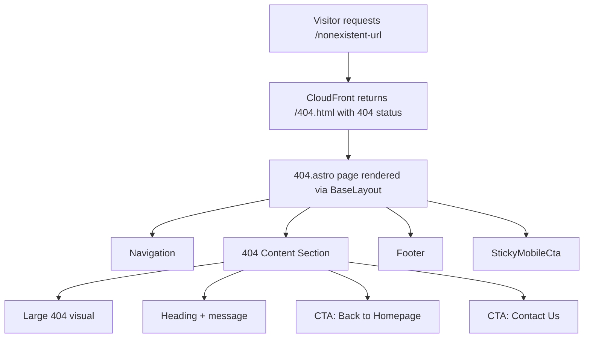

# Design Document: Custom 404 Page

## Overview

This feature adds a single `404.astro` page to the Astro site at `site/src/pages/404.astro`. Astro automatically builds any file named `404.astro` to `/404.html` in the output directory. The CloudFront distribution is already configured with a `custom_error_response` block that serves `/404.html` with a 404 status code for missing resources — so no infrastructure changes are needed.

The page uses `BaseLayout` to inherit Navigation, Footer, StickyMobileCta, and global styles. The content area is a single vertically-centred section containing:
1. A large "404" visual element (styled text, not an image — keeps it lightweight and accessible)
2. A heading: "Page Not Found"
3. A short friendly message
4. Two CTA buttons using existing `.cta-button` classes: "Back to Homepage" (primary) and "Contact Us" (secondary)

The page adds a `<meta name="robots" content="noindex">` tag to prevent search engine indexing. BaseLayout's `title` prop is set to "Page Not Found", rendering as "Page Not Found | Warboys Gutter Clearing" in the browser tab.

## Architecture



The architecture is intentionally flat — a single page component with scoped styles, no new shared components or data fetching. The page slots its content into BaseLayout's `<main>` element via the default `<slot />`.

### Design Decisions

| Decision | Choice | Rationale |
|---|---|---|
| 404 visual element | Styled text (`<span>`) | No image dependency, scales perfectly, accessible, zero extra network requests |
| New component? | No — inline in 404.astro | Single-use content doesn't warrant a separate component |
| Extra head tags | Slot into BaseLayout frontmatter | BaseLayout doesn't have a head slot, so we add `<meta name="robots">` via Astro's built-in `<head>` injection |
| Responsive CTA layout | CSS flexbox with `flex-wrap` | Buttons sit side-by-side on desktop, stack on mobile via media query |

## Components and Interfaces

### 404.astro (New Page)

**Location:** `site/src/pages/404.astro`

**Props passed to BaseLayout:**
- `title`: `"Page Not Found"` — renders as "Page Not Found | Warboys Gutter Clearing"
- `description`: `"The page you're looking for doesn't exist. Head back to our homepage or get in touch."` — for meta description

**HTML Structure:**
```html
<BaseLayout title="Page Not Found" description="...">
  <meta name="robots" content="noindex" slot="head" />  <!-- see note below -->
  <section class="error-page">
    <div class="error-page__container">
      <span class="error-page__code" aria-hidden="true">404</span>
      <h1 class="error-page__heading">Page Not Found</h1>
      <p class="error-page__message">...</p>
      <div class="error-page__actions">
        <a href="/" class="cta-button cta-button--primary">Back to Homepage</a>
        <a href="/contact" class="cta-button cta-button--secondary">Contact Us</a>
      </div>
    </div>
  </section>
</BaseLayout>
```

**Note on `<meta name="robots">`:** BaseLayout does not currently expose a `<slot name="head">`. Two options:
1. Add a named `head` slot to BaseLayout (minor change, reusable)
2. Use Astro's automatic `<head>` propagation — any `<meta>` tag placed directly in the component template outside of a slot will be hoisted to `<head>` by Astro

Option 2 is simpler but unreliable in all Astro versions. Option 1 is a one-line addition to BaseLayout (`<slot name="head" />` inside `<head>`) and is the recommended approach. This is a non-breaking change since no existing pages pass content to that slot.

### BaseLayout.astro (Minor Modification)

Add a named slot inside `<head>`:
```html
<slot name="head" />
```

This goes after the existing `<link>` tags, before `</head>`. No other changes.

## Data Models

No new data models, stores, or external data fetching. The page is entirely static content with no dynamic data requirements.

**CSS Classes Used (from global.css):**
- `.cta-button` — base button styles
- `.cta-button--primary` — yellow background, dark text
- `.cta-button--secondary` — dark background, light text, yellow border

**Design Tokens Referenced:**
- `--color-primary` (#FFD200) — 404 code accent colour
- `--color-secondary` (#111111) — background/text
- `--color-bg-grey` (#F5F5F5) — section background
- `--color-text-dark` (#111111) — heading/body text
- `--font-heading` — Oswald/Montserrat for headings and 404 code
- `--font-body` — Open Sans for message text
- `--space-*` tokens — layout spacing
- `--radius-md`, `--shadow-sm` — container styling
- `--cta-min-size` (44px) — touch target minimum


## Correctness Properties

*A property is a characteristic or behavior that should hold true across all valid executions of a system — essentially, a formal statement about what the system should do. Properties serve as the bridge between human-readable specifications and machine-verifiable correctness guarantees.*

### Property 1: Design token usage over hardcoded values

*For any* CSS declaration in the 404 page's scoped `<style>` block that sets a colour (`color`, `background-color`, `border-color`), font-family, spacing (`padding`, `margin`, `gap`), border-radius, or box-shadow value, the value should reference a CSS custom property (e.g. `var(--color-primary)`) rather than a hardcoded literal (e.g. `#FFD200`, `8px`, `'Oswald'`). Exceptions: `0`, `auto`, `none`, `inherit`, `transparent`, percentage values, and `currentColor` are permitted as literals.

**Validates: Requirements 3.1, 3.2, 3.3**

### Property 2: Colour contrast meets WCAG AA

*For any* foreground/background colour pair used on the 404 page, the contrast ratio shall be at least 4.5:1 for normal-sized text and at least 3:1 for large text (≥18pt or ≥14pt bold), as defined by WCAG 2.1 AA.

**Validates: Requirements 4.1**

## Error Handling

The 404 page itself is the error handler — it is the response to a "resource not found" error. There are no additional error states to handle within the page:

- **No data fetching:** The page is fully static with no API calls or dynamic data, so there are no network error scenarios.
- **No form inputs:** No user input is collected, so there are no validation errors.
- **CloudFront fallback:** If the 404.html file itself were missing from the S3 bucket (deployment failure), CloudFront would return its default error page. This is an infrastructure concern outside the scope of this feature.
- **Broken links on the page:** The two CTA links (`/` and `/contact`) point to pages that are part of the core site. If those pages were removed, the 404 page would still render correctly — the visitor would simply see the 404 page again.

## Testing Strategy

### Unit Tests (Vitest)

Unit tests verify specific structural and content requirements by reading the 404.astro source file and asserting on its contents. These cover the many example-based acceptance criteria:

| Test | Validates |
|---|---|
| `404.astro` file exists at `site/src/pages/404.astro` | Req 1.1 |
| File imports and uses `BaseLayout` | Req 1.3 |
| Contains exactly one `<h1>` element | Req 4.3 |
| Heading text includes "Page Not Found" or similar | Req 2.1 |
| Contains a descriptive `<p>` message | Req 2.2 |
| Contains a "404" visual text element | Req 2.5 |
| Contains an anchor with `href="/"` and text "Back to Homepage" using `cta-button--primary` | Req 2.3, 3.4 |
| Contains an anchor with `href="/contact"` and text "Contact Us" using `cta-button--secondary` | Req 2.4, 3.4 |
| BaseLayout `title` prop is set to "Page Not Found" | Req 4.4, 6.2 |
| Contains `<meta name="robots" content="noindex">` | Req 6.1 |
| Contains a media query at 768px for responsive CTA stacking | Req 5.3 |
| CTA elements use `.cta-button` class (inheriting 44px min touch target) | Req 4.2 |

### Property-Based Tests (Vitest + fast-check)

Property-based tests use `fast-check` (already in devDependencies) to verify universal properties across generated inputs. Each test runs a minimum of 100 iterations.

| Property Test | Design Property | Tag |
|---|---|---|
| All colour/font/spacing CSS declarations reference design tokens | Property 1 | Feature: custom-404-page, Property 1: Design token usage over hardcoded values |
| All foreground/background colour pairs meet WCAG AA contrast ratios | Property 2 | Feature: custom-404-page, Property 2: Colour contrast meets WCAG AA |

**Property 1 implementation approach:** Parse the scoped `<style>` block from `404.astro`. Use fast-check to generate random selections of CSS declarations from the parsed rules. For each selected declaration, assert that colour/font/spacing/radius/shadow values use `var(--...)` syntax rather than hardcoded literals.

**Property 2 implementation approach:** Extract all foreground/background colour pairs from the page's styles (resolving CSS custom properties to their hex values from global.css). Use fast-check to generate random pairs from the extracted set. For each pair, compute the WCAG contrast ratio and assert it meets the AA threshold.

### Test Configuration

- Test runner: Vitest (already configured)
- PBT library: fast-check v4.x (already in devDependencies)
- Minimum iterations per property test: 100
- Each property test must include a comment tag: `Feature: custom-404-page, Property {N}: {title}`
