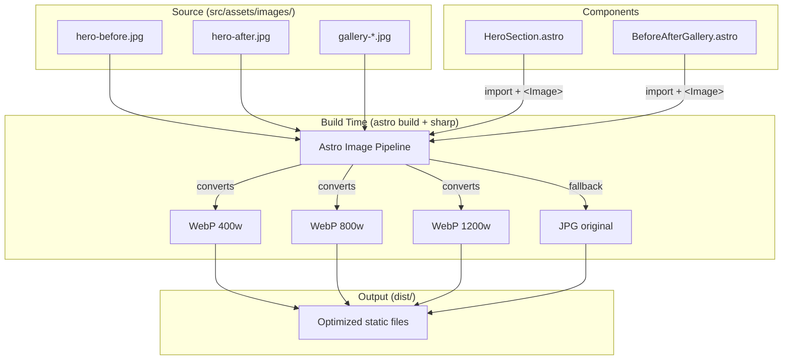

# Design Document

## Overview

This design describes the migration of the Warboys Gutter Clearing website's image pipeline from unoptimized static JPGs served from `public/images/` to build-time optimized images using Astro's built-in `<Image>` component and `sharp` integration. Images are relocated to `src/assets/images/` so Astro can process them during build, generating WebP variants at multiple responsive sizes (400w, 800w, 1200w). The HeroSection and BeforeAfterGallery components are updated to use the `<Image>` component with appropriate loading strategies (eager for hero, lazy for gallery).

## Architecture



### File Changes

```
site/
├── src/
│   ├── assets/
│   │   └── images/              # NEW — moved from public/images/
│   │       ├── hero-before.jpg
│   │       ├── hero-after.jpg
│   │       ├── gallery-1-before.jpg
│   │       ├── gallery-1-after.jpg
│   │       ├── gallery-2-before.jpg
│   │       ├── gallery-2-after.jpg
│   │       ├── gallery-3-before.jpg
│   │       └── gallery-3-after.jpg
│   └── components/
│       ├── HeroSection.astro     # MODIFIED — uses <Image>
│       └── BeforeAfterGallery.astro  # MODIFIED — uses <Image>
├── public/
│   └── images/
│       └── .gitkeep              # Keep directory, remove JPGs
└── package.json                  # sharp added as dependency
```

## Components and Interfaces

### HeroSection.astro (Modified)

Changes:
- Add ESM imports for `hero-before.jpg` and `hero-after.jpg` from `~/assets/images/`
- Import `{ Image }` from `astro:assets`
- Replace `` with `<Image src={heroBefore} ...>`
- Set `loading="eager"` and `fetchpriority="high"` on both hero images
- Set `widths={[400, 800, 1200]}` and `format="webp"` with `fallbackFormat="jpg"`
- Set `sizes="(max-width: 767px) 100vw, 50vw"` to match the 50/50 layout
- Preserve existing `width`, `height`, `alt`, class, and style attributes

```astro
---
import { Image } from 'astro:assets';
import heroBefore from '../assets/images/hero-before.jpg';
import heroAfter from '../assets/images/hero-after.jpg';

const phone = '07936 085632';
const phoneHref = `tel:${phone.replace(/\s/g, '')}`;
---

<!-- In the template, replace  with: -->
<Image
  src={heroBefore}
  alt="Blocked gutter before clearing"
  widths={[400, 800, 1200]}
  sizes="(max-width: 767px) 100vw, 50vw"
  loading="eager"
  fetchpriority="high"
/>
```

### BeforeAfterGallery.astro (Modified)

Changes:
- Import `{ Image }` from `astro:assets`
- Import all gallery images statically from `~/assets/images/`
- Build a lookup map from the imports to use in the `.map()` loop
- Replace `` with `<Image src={...}>`
- Set `loading="lazy"` on all gallery images
- Set `widths={[400, 800, 1200]}` and `format="webp"` with `fallbackFormat="jpg"`
- Set `sizes="(max-width: 479px) 100vw, (max-width: 767px) 50vw, (max-width: 1023px) 25vw, 20vw"` to match the responsive grid
- Preserve existing `width`, `height`, `alt`, class, and style attributes

```astro
---
import { Image } from 'astro:assets';
import gallery1Before from '../assets/images/gallery-1-before.jpg';
import gallery1After from '../assets/images/gallery-1-after.jpg';
import gallery2Before from '../assets/images/gallery-2-before.jpg';
import gallery2After from '../assets/images/gallery-2-after.jpg';
import gallery3Before from '../assets/images/gallery-3-before.jpg';
import gallery3After from '../assets/images/gallery-3-after.jpg';

const galleryItems = [
  { id: 1, alt: "Gutter clearing job 1", before: gallery1Before, after: gallery1After },
  { id: 2, alt: "Gutter clearing job 2", before: gallery2Before, after: gallery2After },
  { id: 3, alt: "Gutter clearing job 3", before: gallery3Before, after: gallery3After },
];
---

<!-- In the template, replace  with: -->
<Image
  src={item.before}
  alt={`Before - ${item.alt}`}
  widths={[400, 800, 1200]}
  sizes="(max-width: 479px) 100vw, (max-width: 767px) 50vw, (max-width: 1023px) 25vw, 20vw"
  loading="lazy"
/>
```

### package.json (Modified)

Add `sharp` as a dependency. Astro 5.x uses sharp automatically when available:

```json
{
  "dependencies": {
    "sharp": "^0.33.0"
  }
}
```

No changes to `astro.config.mjs` are needed — Astro's built-in image optimization is enabled by default when using the `<Image>` component with images imported from `src/`.

## Data Models

No new data models. The Astro `<Image>` component accepts `ImageMetadata` objects returned by ESM image imports:

```typescript
// Type provided by Astro for imported images
interface ImageMetadata {
  src: string;
  width: number;
  height: number;
  format: string;
}
```

## Correctness Properties

### Property 1: All Image components specify responsive widths

*For all* usages of the `<Image>` component in HeroSection.astro and BeforeAfterGallery.astro, the `widths` prop SHALL include the values 400, 800, and 1200.

**Validates: Requirements 3.1**

### Property 2: All Image components include width and height

*For all* `<Image>` component usages in HeroSection.astro and BeforeAfterGallery.astro, the rendered output SHALL include explicit `width` and `height` attributes (provided automatically by Astro from the imported ImageMetadata).

**Validates: Requirements 4.1**

### Property 3: Hero images use eager loading

*For all* `<Image>` component usages in HeroSection.astro, the `loading` attribute SHALL be `"eager"` and the `fetchpriority` attribute SHALL be `"high"`.

**Validates: Requirements 5.1, 5.3**

### Property 4: Gallery images use lazy loading

*For all* `<Image>` component usages in BeforeAfterGallery.astro, the `loading` attribute SHALL be `"lazy"`.

**Validates: Requirements 5.2**

### Property 5: No images reference public/images/ paths

*For all* `` or `<Image>` elements in HeroSection.astro and BeforeAfterGallery.astro, the `src` attribute SHALL NOT contain the string `/images/` as a static path prefix (indicating an unoptimized public path).

**Validates: Requirements 6.1, 6.2, 6.5**

## Error Handling

| Scenario | Handling |
|---|---|
| Source image file missing from Assets_Directory | Astro build fails with a clear import error identifying the missing file. Developer must add the missing image. |
| sharp not installed | Astro falls back to its built-in image processing (slower but functional). A console warning is displayed during build. |
| Unsupported image format in source | Astro/sharp will throw a build error. Only JPG, PNG, WebP, AVIF, GIF, and SVG are supported. |
| Image import path typo in component | TypeScript/Astro build fails with a module-not-found error. Developer corrects the import path. |

## Testing Strategy

### Unit Tests (Example-Based)

Use Vitest to verify component source code structure:

1. **HeroSection uses Image component**: Verify that `HeroSection.astro` source contains `import { Image } from 'astro:assets'` and does not contain `` tag uses a `/images/` static path. Generate random path prefixes and verify they would be caught by the detection logic.

### Test File Structure

```
site/src/components/__tests__/
  image-optimization.test.ts    # All image optimization tests
```

### Test Configuration

```json
{
  "testRunner": "vitest",
  "pbtLibrary": "fast-check",
  "pbtMinIterations": 100
}
```
