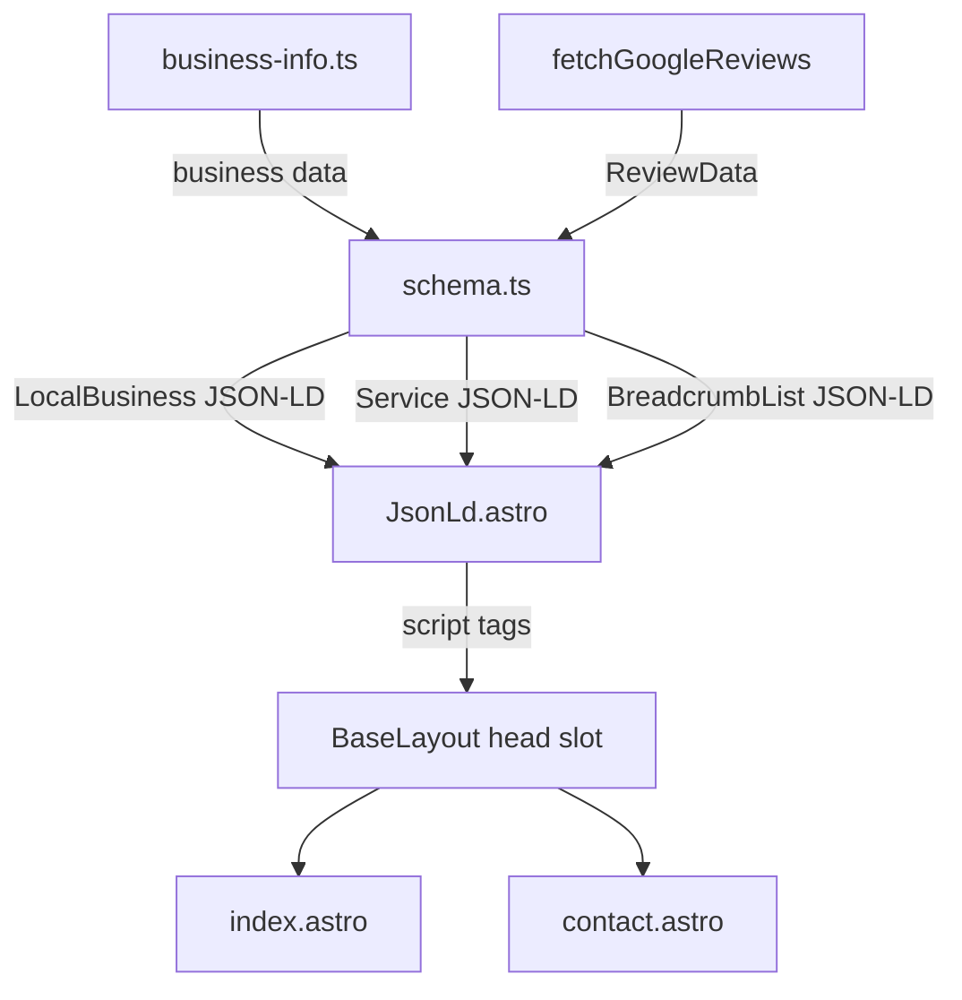

# Design Document

## Overview

This design adds Schema.org JSON-LD structured data to the Warboys Gutter Clearing website. A central business data file (`src/data/business-info.ts`) provides all business details. A schema generator module (`src/lib/schema.ts`) builds LocalBusiness, Service, AggregateRating, and BreadcrumbList JSON-LD objects. These are injected as `<script type="application/ld+json">` tags in the `<head>` via a reusable `JsonLd.astro` component. The homepage gets LocalBusiness (with optional AggregateRating) and Service schemas; the contact page gets a BreadcrumbList schema.

## Architecture



### File Structure (new/modified files only)

```
site/src/
├── data/
│   └── business-info.ts          # NEW — central business details
├── lib/
│   ├── schema.ts                 # NEW — JSON-LD generator functions
│   └── __tests__/
│       └── schema.test.ts        # NEW — unit + property tests
├── components/
│   └── JsonLd.astro              # NEW — renders <script type="application/ld+json">
├── layouts/
│   └── BaseLayout.astro          # MODIFIED — add head slot for JSON-LD
└── pages/
    ├── index.astro               # MODIFIED — generate and inject schemas
    └── contact.astro             # MODIFIED — generate and inject breadcrumb schema
```

## Components and Interfaces

### `src/data/business-info.ts`

Central data file exporting business details. All schema generators read from this file.

```typescript
export interface BusinessAddress {
  streetAddress: string;
  addressLocality: string;
  addressRegion: string;
  postalCode: string;
  addressCountry: string;
}

export interface ServiceInfo {
  name: string;
  description: string;
}

export interface BusinessInfo {
  name: string;
  address: BusinessAddress;
  telephone: string;
  email: string;
  url: string;
  googleBusinessUrl: string;
  serviceAreaLocalities: string[];
  services: ServiceInfo[];
}

export const businessInfo: BusinessInfo = {
  name: "Warboys Gutter Clearing",
  address: {
    streetAddress: "Warboys",
    addressLocality: "Warboys",
    addressRegion: "Cambridgeshire",
    postalCode: "PE28",
    addressCountry: "GB",
  },
  telephone: "07936085632",
  email: "warboysgutterclearing@btinternet.com",
  url: "https://warboysgutterclearing.co.uk",
  googleBusinessUrl: "https://search.google.com/local/reviews",
  serviceAreaLocalities: [
    "Warboys", "Ramsey", "St Ives", "Huntingdon", "Somersham",
    "Chatteris", "March", "Ely", "St Neots", "Godmanchester", "Sawtry",
  ],
  services: [
    {
      name: "Gutter Clearing",
      description: "Complete debris removal from gutters by hand or using the Predator specialist gutter vacuum system.",
    },
    {
      name: "Downpipe Unblocking",
      description: "Clearing blocked downpipes to restore proper drainage and protect your property from water damage.",
    },
    {
      name: "Supply & Installation of Downpipe Gutter Guards",
      description: "Professionally fitted gutter guards to prevent future blockages from leaves and debris.",
    },
  ],
};
```

### `src/lib/schema.ts`

Pure functions that build JSON-LD objects. No side effects, easily testable.

```typescript
import type { BusinessInfo } from "../data/business-info";
import type { ReviewData } from "../data/hardcoded-testimonials";

export function buildLocalBusinessSchema(
  business: BusinessInfo,
  reviewData?: ReviewData,
): Record<string, unknown> {
  const schema: Record<string, unknown> = {
    "@context": "https://schema.org",
    "@type": "LocalBusiness",
    name: business.name,
    address: {
      "@type": "PostalAddress",
      streetAddress: business.address.streetAddress,
      addressLocality: business.address.addressLocality,
      addressRegion: business.address.addressRegion,
      postalCode: business.address.postalCode,
      addressCountry: business.address.addressCountry,
    },
    telephone: business.telephone,
    email: business.email,
    url: business.url,
    areaServed: business.serviceAreaLocalities.map((locality) => ({
      "@type": "Place",
      name: locality,
    })),
    hasOfferCatalog: {
      "@type": "OfferCatalog",
      name: "Gutter Services",
      itemListElement: business.services.map((s) => ({
        "@type": "OfferCatalog",
        name: s.name,
        description: s.description,
      })),
    },
  };

  if (reviewData && reviewData.source === "google") {
    const googleReviewCount =
      reviewData.reviews.length -
      (reviewData.source === "google"
        ? reviewData.reviews.filter((r) =>
            // hardcoded reviews won't have Google-style relativeTime
            false
          ).length
        : 0);
    // Simpler: count is total minus hardcoded count
    schema.aggregateRating = {
      "@type": "AggregateRating",
      ratingValue: reviewData.overallRating,
      reviewCount: reviewData.reviews.length,
      bestRating: 5,
      worstRating: 1,
    };
  }

  return schema;
}

export function buildServiceSchemas(
  business: BusinessInfo,
): Record<string, unknown>[] {
  return business.services.map((service) => ({
    "@context": "https://schema.org",
    "@type": "Service",
    name: service.name,
    description: service.description,
    provider: {
      "@type": "LocalBusiness",
      name: business.name,
      url: business.url,
    },
    areaServed: business.serviceAreaLocalities.map((locality) => ({
      "@type": "Place",
      name: locality,
    })),
  }));
}

export function buildBreadcrumbSchema(
  siteUrl: string,
  items: { name: string; url: string }[],
): Record<string, unknown> {
  return {
    "@context": "https://schema.org",
    "@type": "BreadcrumbList",
    itemListElement: items.map((item, index) => ({
      "@type": "ListItem",
      position: index + 1,
      name: item.name,
      item: item.url,
    })),
  };
}
```

### `src/components/JsonLd.astro`

Minimal component that renders a JSON-LD script tag.

```astro
---
interface Props {
  schema: Record<string, unknown> | Record<string, unknown>[];
}

const { schema } = Astro.props;
const schemas = Array.isArray(schema) ? schema : [schema];
---

{schemas.map((s) => (
  <script type="application/ld+json" set:html={JSON.stringify(s)} />
))}
```

### `src/layouts/BaseLayout.astro` (modification)

Add a named `head` slot so pages can inject content into `<head>`:

```diff
  <head>
    ...existing meta tags...
+   <slot name="head" />
  </head>
```

### `src/pages/index.astro` (modification)

Import schema generators and inject JSON-LD into the head slot:

```diff
  ---
+ import { businessInfo } from '../data/business-info';
+ import { buildLocalBusinessSchema, buildServiceSchemas } from '../lib/schema';
+ import JsonLd from '../components/JsonLd.astro';

  const reviewData = await fetchGoogleReviews();
+ const localBusinessSchema = buildLocalBusinessSchema(businessInfo, reviewData);
+ const serviceSchemas = buildServiceSchemas(businessInfo);
  ---

  <BaseLayout title="Professional Gutter Clearing in Cambridgeshire">
+   <Fragment slot="head">
+     <JsonLd schema={localBusinessSchema} />
+     {serviceSchemas.map((s) => <JsonLd schema={s} />)}
+   </Fragment>
    <HeroSection />
    ...
  </BaseLayout>
```

### `src/pages/contact.astro` (modification)

Import breadcrumb generator and inject JSON-LD:

```diff
  ---
+ import { businessInfo } from '../data/business-info';
+ import { buildBreadcrumbSchema } from '../lib/schema';
+ import JsonLd from '../components/JsonLd.astro';

+ const siteUrl = businessInfo.url;
+ const breadcrumbSchema = buildBreadcrumbSchema(siteUrl, [
+   { name: 'Home', url: siteUrl },
+   { name: 'Contact Us', url: `${siteUrl}/contact` },
+ ]);
  ---

  <BaseLayout title="Contact Us" ...>
+   <Fragment slot="head">
+     <JsonLd schema={breadcrumbSchema} />
+   </Fragment>
    ...
  </BaseLayout>
```

## Data Models

### BusinessInfo

See `src/data/business-info.ts` interface above. Single source of truth for all business details.

### JSON-LD Output Shapes

**LocalBusiness:**
```json
{
  "@context": "https://schema.org",
  "@type": "LocalBusiness",
  "name": "Warboys Gutter Clearing",
  "address": { "@type": "PostalAddress", ... },
  "telephone": "07936085632",
  "email": "warboysgutterclearing@btinternet.com",
  "url": "https://warboysgutterclearing.co.uk",
  "areaServed": [{ "@type": "Place", "name": "Warboys" }, ...],
  "hasOfferCatalog": { "@type": "OfferCatalog", ... },
  "aggregateRating": { "@type": "AggregateRating", ... }
}
```

**Service:**
```json
{
  "@context": "https://schema.org",
  "@type": "Service",
  "name": "Gutter Clearing",
  "description": "...",
  "provider": { "@type": "LocalBusiness", "name": "...", "url": "..." },
  "areaServed": [...]
}
```

**BreadcrumbList:**
```json
{
  "@context": "https://schema.org",
  "@type": "BreadcrumbList",
  "itemListElement": [
    { "@type": "ListItem", "position": 1, "name": "Home", "item": "https://..." },
    { "@type": "ListItem", "position": 2, "name": "Contact Us", "item": "https://.../contact" }
  ]
}
```

## Correctness Properties

### Property 1: LocalBusiness schema mirrors business data

*For any* valid BusinessInfo input, the LocalBusiness JSON-LD object produced by `buildLocalBusinessSchema()` SHALL contain the same `name`, `telephone`, `email`, and `url` values as the input, and the `address` object SHALL contain matching `streetAddress`, `addressLocality`, `addressRegion`, `postalCode`, and `addressCountry`.

**Validates: Requirements 1.4, 2.1, 7.1**

### Property 2: AggregateRating presence depends on review source

*For any* ReviewData with `source` equal to `"google"`, the LocalBusiness schema SHALL include an `aggregateRating` property. *For any* ReviewData with `source` equal to `"hardcoded"`, the LocalBusiness schema SHALL NOT include an `aggregateRating` property.

**Validates: Requirements 3.1, 3.2**

### Property 3: Service count matches input

*For any* BusinessInfo with N services, `buildServiceSchemas()` SHALL return exactly N Service JSON-LD objects, each with `@type` set to `"Service"`, a `name` matching the corresponding input service name, and a `description` matching the corresponding input service description.

**Validates: Requirements 4.1, 4.3**

### Property 4: All JSON-LD objects include @context

*For any* JSON-LD object produced by `buildLocalBusinessSchema()`, `buildServiceSchemas()`, or `buildBreadcrumbSchema()`, the object SHALL contain `"@context"` set to `"https://schema.org"`.

**Validates: Requirements 6.2**

### Property 5: JSON-LD round-trip serialisation

*For any* JSON-LD object produced by the SchemaGenerator functions, `JSON.parse(JSON.stringify(object))` SHALL produce a deeply equal object.

**Validates: Requirements 6.3**

### Property 6: areaServed completeness

*For any* BusinessInfo with K service area localities, the LocalBusiness schema `areaServed` array SHALL contain exactly K entries, and each entry's `name` SHALL match the corresponding locality from the input.

**Validates: Requirements 2.4**

## Error Handling

| Scenario | Handling |
|---|---|
| ReviewData is undefined or missing | `buildLocalBusinessSchema()` omits `aggregateRating`. No error thrown. |
| Business data has empty services array | `buildServiceSchemas()` returns an empty array. No Service script tags rendered. |
| JSON serialisation of schema fails | Extremely unlikely with plain objects. If it occurs, Astro build will fail with a clear error. |

## Testing Strategy

### Unit Tests (Example-Based)

- `businessInfo` exports all required fields with correct types
- `buildLocalBusinessSchema()` with real `businessInfo` produces valid LocalBusiness with correct values
- `buildLocalBusinessSchema()` with google ReviewData includes aggregateRating
- `buildLocalBusinessSchema()` with hardcoded ReviewData omits aggregateRating
- `buildServiceSchemas()` produces 3 Service objects matching the 3 defined services
- `buildBreadcrumbSchema()` produces correct 2-item breadcrumb for contact page
- All generated schemas have `@context` set to `https://schema.org`

### Property-Based Tests

Use `fast-check` with Vitest, minimum 100 iterations per property.

1. **Property 1: LocalBusiness schema mirrors business data** — Generate random BusinessInfo objects and verify output fields match input.
2. **Property 2: AggregateRating presence depends on review source** — Generate random ReviewData with random source ('google' | 'hardcoded') and verify presence/absence of aggregateRating.
3. **Property 3: Service count matches input** — Generate random arrays of ServiceInfo and verify output count and field values match.
4. **Property 4: All JSON-LD objects include @context** — Generate random inputs for all three builder functions and verify @context is present.
5. **Property 5: JSON-LD round-trip serialisation** — Generate random inputs, build schemas, serialise and parse, verify deep equality.
6. **Property 6: areaServed completeness** — Generate random locality arrays and verify areaServed output matches.

### Test Configuration

```json
{
  "testRunner": "vitest",
  "pbtLibrary": "fast-check",
  "pbtMinIterations": 100,
  "testFile": "site/src/lib/__tests__/schema.test.ts"
}
```
