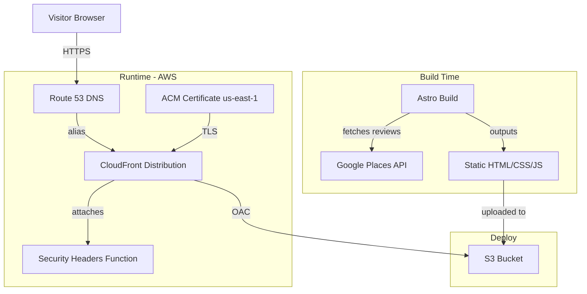

# Design Document

## Overview

This design describes the architecture and implementation of the Warboys Gutter Clearing website — a static marketing site built with Astro, hosted on AWS (S3 + CloudFront), and provisioned via Terraform. The site consists of a single-page homepage with anchor-linked sections and a dedicated Contact Us page. At build time, the Astro build fetches Google Business reviews via the Google Places API (New) and renders them as static HTML, ensuring no API keys are exposed client-side. The visual design follows a bold yellow (#FFD200) and black (#111111) trade aesthetic with Oswald/Montserrat headings and Open Sans body text.

The project is split into two top-level directories: `site/` (Astro project) and `infra/` (Terraform configuration).

## Architecture



### Project Structure

```
warboys-gutter-website/
├── site/                          # Astro project
│   ├── astro.config.mjs
│   ├── package.json
│   ├── tsconfig.json
│   ├── public/
│   │   ├── images/                # Before/after photos, icons
│   │   └── favicon.svg
│   └── src/
│       ├── layouts/
│       │   └── BaseLayout.astro   # HTML shell, fonts, meta, Design_System CSS vars
│       ├── pages/
│       │   ├── index.astro        # Homepage (all sections)
│       │   └── contact.astro      # Contact Us page
│       ├── components/
│       │   ├── Navigation.astro
│       │   ├── HeroSection.astro
│       │   ├── TrustBar.astro
│       │   ├── ServicesSection.astro
│       │   ├── HowItWorks.astro
│       │   ├── WhyChooseUs.astro
│       │   ├── BeforeAfterGallery.astro
│       │   ├── AboutSection.astro
│       │   ├── TestimonialsSection.astro
│       │   ├── ServiceAreaSection.astro
│       │   ├── CtaBanner.astro
│       │   ├── Footer.astro
│       │   ├── StickyMobileCta.astro
│       │   ├── ContactForm.astro
│       │   └── StarRating.astro
│       ├── data/
│       │   └── hardcoded-testimonials.ts  # Fallback testimonials
│       ├── lib/
│       │   └── google-reviews.ts  # Build-time Google Places API fetch
│       └── styles/
│           └── global.css         # CSS custom properties, resets, Design_System tokens
├── infra/                         # Terraform
│   ├── main.tf                    # Root module composition
│   ├── variables.tf               # Input variables
│   ├── outputs.tf                 # Outputs (CloudFront URL, S3 bucket name)
│   ├── providers.tf               # AWS provider config (default + us-east-1 alias)
│   └── modules/
│       ├── s3/
│       │   ├── main.tf
│       │   ├── variables.tf
│       │   └── outputs.tf
│       ├── cloudfront/
│       │   ├── main.tf
│       │   ├── variables.tf
│       │   └── outputs.tf
│       ├── acm/
│       │   ├── main.tf
│       │   ├── variables.tf
│       │   └── outputs.tf
│       └── dns/
│           ├── main.tf
│           ├── variables.tf
│           └── outputs.tf
└── README.md
```

## Components and Interfaces

### Astro Components

#### BaseLayout (`src/layouts/BaseLayout.astro`)

The root HTML layout used by all pages. Responsibilities:
- Renders `<html>`, `<head>` (meta tags, Open Graph, Google Fonts preconnect, global CSS), and `<body>`.
- Includes `Navigation`, `StickyMobileCta`, and `Footer` so they appear on every page.
- Accepts a `title` and optional `description` prop for per-page SEO.
- Defines CSS custom properties for the Design_System on `:root`.

#### Navigation (`src/components/Navigation.astro`)

Sticky top navigation bar.
- Desktop: horizontal link list — Home, Services, How It Works, Why Choose Us, Gallery, About, Testimonials, Service Area, Contact Us.
- Mobile (<768px): hamburger toggle revealing a slide-down menu.
- All links except "Contact Us" are anchor links (`/#services`, `/#how-it-works`, etc.) that smooth-scroll on the homepage.
- "Contact Us" links to `/contact`.
- Uses `position: sticky; top: 0; z-index: 1000`.
- Small inline `<script>` handles the mobile toggle (no framework JS needed).

#### HeroSection (`src/components/HeroSection.astro`)

- Dark background (#111111), Primary_Colour accents.
- `<h1>` with "Blocked Gutters? We Clear Them Fast."
- Three trust bullet `<li>` items with check/shield icons.
- Two CTA buttons: "Get a Free Quote" (`/contact`) and "Call Now" (`tel:PHONE`).
- Before/after split image using CSS `clip-path` or a side-by-side layout with a divider.

#### TrustBar (`src/components/TrustBar.astro`)

- Horizontal flex row of 4 trust signals with SVG icons: "Local & Reliable", "Fully Insured", "Easy Booking", "Covering Cambridgeshire".
- Wraps on mobile via `flex-wrap: wrap`.

#### ServicesSection (`src/components/ServicesSection.astro`)

- White background, CSS grid of 3 service cards.
- Each card: black line SVG icon, Primary_Colour top border or accent, heading, short description.
- Describes hand clearing and Predator vacuum methods within the Gutter Clearing card.
- Inline CTA link after the cards.

#### HowItWorks (`src/components/HowItWorks.astro`)

- Light grey (#F5F5F5) background.
- 3-step horizontal layout (desktop) / vertical stack (mobile).
- Each step: numbered circle with Primary_Colour, title, description.
- Connecting line/arrow between steps on desktop.

#### WhyChooseUs (`src/components/WhyChooseUs.astro`)

- Black (#111111) background, white text, Primary_Colour icon accents.
- 5 differentiator items in a grid or list, each with an icon.

#### BeforeAfterGallery (`src/components/BeforeAfterGallery.astro`)

- Responsive CSS grid: 1 column mobile, 2-3 columns desktop.
- 4-6 image pairs, each with "Before" / "After" labels.
- Primary_Colour border, hover scale effect.
- Images served from `public/images/` as optimised formats.

#### AboutSection (`src/components/AboutSection.astro`)

- Short paragraph about the business, mentioning Cambridgeshire locality.

#### TestimonialsSection (`src/components/TestimonialsSection.astro`)

- Receives review data as a prop (fetched at build time in `index.astro`).
- Displays overall Star_Rating (numeric + visual stars via `StarRating` component).
- Renders review cards: reviewer name, star rating, text, relative time.
- If >3 reviews, renders a simple CSS scroll carousel or paginated view.
- Link to Google Business Profile listing.

#### StarRating (`src/components/StarRating.astro`)

- Accepts a `rating` number prop (1-5).
- Renders filled/empty star SVGs. Supports half-stars via `clip-path`.

#### ServiceAreaSection (`src/components/ServiceAreaSection.astro`)

- Lists covered towns/villages in Cambridgeshire.
- Mentions Warboys as the primary base.

#### CtaBanner (`src/components/CtaBanner.astro`)

- Full-width Primary_Colour (#FFD200) background.
- Heading + two CTA buttons (Get a Free Quote, Call Now).
- Hazard_Stripe_Accent top/bottom border.

#### Footer (`src/components/Footer.astro`)

- Dark background, white text.
- Phone (tel: link), email, service area summary.
- Navigation links mirroring the main Navigation.
- Copyright with dynamic current year via Astro build.

#### StickyMobileCta (`src/components/StickyMobileCta.astro`)

- `position: fixed; bottom: 0; z-index: 1100`.
- Two buttons: "Call Now" (tel:) and "Get Quote" (/contact).
- Primary_Colour background, Secondary_Colour text.
- Hidden on viewports ≥768px via CSS media query.

#### ContactForm (`src/components/ContactForm.astro`)

- HTML `<form>` with fields: name, email, tel, address (all required), message (optional).
- Client-side validation via HTML5 `required` + `type` attributes.
- On submit, sends data via `fetch()` to a form handling endpoint (e.g. Formspree, or a simple API Gateway + Lambda — out of scope for this spec, configurable via a form action URL).
- Displays inline validation messages for missing required fields.
- Displays a success confirmation message on successful submission.

### Build-Time Data Fetching

#### `src/lib/google-reviews.ts`

Exports an async function `fetchGoogleReviews()`:

```typescript
interface GoogleReview {
  authorName: string;
  rating: number;
  text: string;
  relativeTime: string;
}

interface ReviewData {
  overallRating: number;
  reviews: GoogleReview[];
  source: 'google' | 'hardcoded';
}

async function fetchGoogleReviews(): Promise<ReviewData>
```

Logic:
1. Read `GOOGLE_PLACE_ID` and `GOOGLE_PLACES_API_KEY` from `import.meta.env`.
2. If either is missing, return hardcoded testimonials with `source: 'hardcoded'`.
3. Call `https://places.googleapis.com/v1/places/{placeId}` with field mask `reviews,rating` and header `X-Goog-Api-Key`.
4. If the response fails or returns <3 reviews, return hardcoded testimonials.
5. If ≥3 reviews, return Google reviews with hardcoded testimonials appended, `source: 'google'`.

#### `src/data/hardcoded-testimonials.ts`

Exports an array of fallback testimonials matching the `GoogleReview` interface shape, with `relativeTime` set to a static string.

### Pages

#### `src/pages/index.astro`

- Uses `BaseLayout`.
- Calls `fetchGoogleReviews()` in the frontmatter (runs at build time).
- Renders sections in order: HeroSection → TrustBar → ServicesSection → (inline CTA) → HowItWorks → (inline CTA) → WhyChooseUs → BeforeAfterGallery → AboutSection → TestimonialsSection → (inline CTA) → ServiceAreaSection → CtaBanner.

#### `src/pages/contact.astro`

- Uses `BaseLayout` with title "Contact Us".
- Renders ContactForm + business phone/email details.

### Terraform Modules

#### S3 Module (`infra/modules/s3/`)

- Creates a private S3 bucket (no public access).
- Configures bucket policy to allow CloudFront OAC read access.
- Variables: `bucket_name`, `cloudfront_distribution_arn`.

#### CloudFront Module (`infra/modules/cloudfront/`)

- Creates a CloudFront distribution with:
  - S3 OAC origin.
  - `Price_Class_100`.
  - Custom domain aliases (apex + www).
  - ACM certificate reference.
  - Default root object: `index.html`.
  - Custom error response: 404 → `/404.html` (or `/index.html`).
  - Response headers policy for Security_Headers (CSP, X-Frame-Options, X-Content-Type-Options, HSTS, Referrer-Policy).
  - www → apex redirect via a CloudFront Function.
- Variables: `s3_bucket_regional_domain`, `s3_bucket_id`, `acm_certificate_arn`, `domain_name`, `aliases`.

#### ACM Module (`infra/modules/acm/`)

- Provisions an ACM certificate in `us-east-1` for the apex domain and www subdomain (SAN).
- Uses DNS validation with Route 53.
- Variables: `domain_name`, `zone_id`.

#### DNS Module (`infra/modules/dns/`)

- Creates A and AAAA alias records for apex and www pointing to the CloudFront distribution.
- Variables: `zone_id`, `domain_name`, `cloudfront_distribution_domain_name`, `cloudfront_distribution_hosted_zone_id`.

## Data Models

### Review Data (Build-Time)

```typescript
/** A single review, either from Google or hardcoded */
interface Review {
  authorName: string;
  rating: number;       // 1-5
  text: string;
  relativeTime: string; // e.g. "2 weeks ago" or static string for hardcoded
}

/** Aggregated review data passed to TestimonialsSection */
interface ReviewData {
  overallRating: number;       // 1.0-5.0
  reviews: Review[];           // Google reviews first, then hardcoded appended
  source: 'google' | 'hardcoded';
  profileUrl: string;          // Link to Google Business Profile
}
```

### Contact Form Data

```typescript
interface ContactFormData {
  name: string;        // required
  email: string;       // required, validated as email format
  telephone: string;   // required
  address: string;     // required
  message?: string;    // optional
}
```

### Hardcoded Testimonial Data

```typescript
// src/data/hardcoded-testimonials.ts
const hardcodedTestimonials: Review[] = [
  {
    authorName: "Customer Name",
    rating: 5,
    text: "Review text...",
    relativeTime: "Recently"
  },
  // ... at least 3 entries
];
```

### Design System Tokens (CSS Custom Properties)

```css
:root {
  /* Colours */
  --color-primary: #FFD200;
  --color-secondary: #111111;
  --color-bg-white: #FFFFFF;
  --color-bg-grey: #F5F5F5;
  --color-text-light: #FFFFFF;
  --color-text-dark: #111111;

  /* Typography */
  --font-heading: 'Oswald', 'Montserrat', sans-serif;
  --font-body: 'Open Sans', sans-serif;

  /* Spacing */
  --space-xs: 0.25rem;
  --space-sm: 0.5rem;
  --space-md: 1rem;
  --space-lg: 2rem;
  --space-xl: 4rem;

  /* Borders */
  --radius-sm: 4px;
  --radius-md: 8px;

  /* Shadows */
  --shadow-sm: 0 1px 3px rgba(0,0,0,0.12);
  --shadow-md: 0 4px 12px rgba(0,0,0,0.15);

  /* CTA min touch target */
  --cta-min-size: 44px;
}
```

### Terraform Variables

```hcl
variable "domain_name" {
  description = "Apex domain name"
  type        = string
  default     = "warboysgutterclearing.co.uk"
}

variable "hosted_zone_id" {
  description = "Existing Route 53 hosted zone ID"
  type        = string
}

variable "bucket_name" {
  description = "S3 bucket name for website files"
  type        = string
  default     = "warboysgutterclearing-website"
}
```


## Correctness Properties

*A property is a characteristic or behavior that should hold true across all valid executions of a system — essentially, a formal statement about what the system should do. Properties serve as the bridge between human-readable specifications and machine-verifiable correctness guarantees.*

### Property 1: Excluded services never appear

*For any* rendering of the Services_Section, the output HTML shall not contain the strings "gutter repair", "fascia cleaning", "soffit cleaning", or "roof cleaning" (case-insensitive).

**Validates: Requirements 5.6**

### Property 2: Review rendering completeness

*For any* Review object passed to the TestimonialsSection component, the rendered output for that review shall contain the reviewer's `authorName`, `rating` (as a numeric or star visual), `text`, and `relativeTime`.

**Validates: Requirements 10.4**

### Property 3: Minimum review count invariant

*For any* ReviewData object produced by `fetchGoogleReviews()`, the `reviews` array shall contain at least 3 entries, regardless of whether the source is `'google'` or `'hardcoded'`.

**Validates: Requirements 10.5**

### Property 4: Review fetch fallback on unavailability

*For any* configuration where `GOOGLE_PLACE_ID` is missing, `GOOGLE_PLACES_API_KEY` is missing, the Google Places API returns an error, or the API returns fewer than 3 reviews, `fetchGoogleReviews()` shall return a ReviewData with `source: 'hardcoded'` and reviews populated from the hardcoded testimonials.

**Validates: Requirements 10.7, 10.11**

### Property 5: Successful fetch appends hardcoded testimonials

*For any* successful Google Places API response containing 3 or more reviews, `fetchGoogleReviews()` shall return a ReviewData where the `reviews` array begins with the Google reviews and ends with the hardcoded testimonials appended, and `source` is `'google'`.

**Validates: Requirements 10.8**

### Property 6: No API key in build output

*For any* file in the Astro build output directory, the content shall not contain the value of the `GOOGLE_PLACES_API_KEY` environment variable.

**Validates: Requirements 10.10**

### Property 7: Contact form validation rejects incomplete submissions

*For any* ContactFormData where at least one required field (name, email, telephone, address) is empty or missing, the form validation function shall return a failure result identifying all missing fields, and the form shall not be submitted.

**Validates: Requirements 12.5**

### Property 8: Valid contact form submission sends data

*For any* ContactFormData where all required fields (name, email, telephone, address) are non-empty and the email is valid, the form submission handler shall POST the data to the configured form endpoint.

**Validates: Requirements 12.4**

### Property 9: CTA touch target minimum size

*For all* CTA button elements on the Website, the computed width and height shall each be at least 44px.

**Validates: Requirements 15.4**

### Property 10: Colour contrast compliance

*For all* foreground/background colour pairs defined in the Design_System and used for text rendering, the contrast ratio shall be at least 4.5:1 for normal text and at least 3:1 for large text (≥18pt or ≥14pt bold).

**Validates: Requirements 15.5**

### Property 11: Security headers completeness

*For all* responses served by the CloudFront_Distribution, the response headers shall include Content-Security-Policy, X-Frame-Options, X-Content-Type-Options, Strict-Transport-Security, and Referrer-Policy.

**Validates: Requirements 17.4**

## Error Handling

### Google Places API Errors

| Scenario | Handling |
|---|---|
| Missing `GOOGLE_PLACE_ID` or `GOOGLE_PLACES_API_KEY` env var | Skip API call entirely, use hardcoded testimonials. Log a warning during build. |
| API returns HTTP error (4xx/5xx) | Catch error, log warning, fall back to hardcoded testimonials. Build continues successfully. |
| API returns <3 reviews | Fall back to hardcoded testimonials. |
| API returns malformed JSON | Catch parse error, log warning, fall back to hardcoded testimonials. |
| API timeout | Set a 10-second timeout on the fetch call. On timeout, fall back to hardcoded testimonials. |

The build must never fail due to Google API issues. The fallback path ensures the site always deploys with testimonial content.

### Contact Form Errors

| Scenario | Handling |
|---|---|
| Required field empty on submit | Prevent submission, show inline validation message per field using HTML5 constraint validation + custom styling. |
| Invalid email format | Show "Please enter a valid email address" message. |
| Form endpoint unreachable | Show a user-friendly error: "Sorry, something went wrong. Please call us directly at [phone]." |
| Form endpoint returns error | Show the same user-friendly error with phone fallback. |
| Successful submission | Show confirmation message: "Thanks! We'll be in touch shortly." Clear the form. |

### Infrastructure / Terraform Errors

| Scenario | Handling |
|---|---|
| ACM certificate validation timeout | Terraform will wait for DNS validation. If the hosted zone ID is wrong, `terraform apply` will fail with a clear error. The `acm` module uses `create_before_destroy` lifecycle. |
| S3 bucket name conflict | Terraform will fail on `apply` if the bucket name is taken. Use a unique bucket name variable. |
| CloudFront distribution creation delay | CloudFront distributions can take 10-15 minutes to deploy. Terraform handles this with built-in polling. |

### 404 / Missing Pages

CloudFront custom error response maps 404 to a custom 404 page (`/404.html`) with a 404 status code, providing a branded error experience with navigation back to the homepage.

## Testing Strategy

### Unit Tests (Example-Based)

Unit tests verify specific, concrete examples and edge cases. Use a test runner appropriate for the Astro/Node.js ecosystem (Vitest recommended).

**Scope:**
- Navigation contains all required links (Req 2.1)
- Hero section contains correct heading, trust bullets, and CTAs (Req 3.2, 3.3, 3.4)
- Trust bar contains all 4 trust signals (Req 4.2)
- Services section lists correct services and methods (Req 5.1, 5.3, 5.4, 5.5)
- How It Works displays correct steps (Req 6.3, 6.4)
- Why Choose Us displays all differentiators (Req 7.2, 7.3)
- Gallery has 4-6 image pairs with labels (Req 8.1, 8.3)
- About section mentions Cambridgeshire (Req 9.2)
- Contact form has all required fields with correct attributes (Req 12.1)
- Footer contains phone, email, nav links, copyright (Req 13.1-13.4)
- CTA banner contains correct buttons (Req 14.1, 14.2)
- Design system CSS variables are correctly defined (Req 15.1, 15.2, 15.6)
- Sticky mobile CTA contains correct buttons (Req 16.2)
- Terraform plan produces expected resources (Req 17.1-17.3, 17.5-17.8)
- `fetchGoogleReviews()` reads from correct env vars (Req 10.2)
- StarRating component renders correct number of filled stars for rating values 1-5 (Req 10.3)

### Property-Based Tests

Property-based tests verify universal properties across many generated inputs. Use `fast-check` as the property-based testing library with Vitest.

Each property test must:
- Run a minimum of 100 iterations
- Reference the design property it validates via a comment tag
- Use `fast-check` arbitraries to generate random valid inputs

**Property test implementations:**

1. **Feature: warboys-gutter-website, Property 1: Excluded services never appear**
   Generate random service section content configurations and verify excluded service names never appear in output.

2. **Feature: warboys-gutter-website, Property 2: Review rendering completeness**
   Generate random Review objects (random authorName, rating 1-5, random text, random relativeTime) and verify all fields appear in rendered output.

3. **Feature: warboys-gutter-website, Property 3: Minimum review count invariant**
   Generate random API response scenarios (success with varying review counts, failures, missing env vars) and verify the output always has ≥3 reviews.

4. **Feature: warboys-gutter-website, Property 4: Review fetch fallback on unavailability**
   Generate random failure scenarios (missing env vars, API errors, <3 reviews) and verify the function returns hardcoded testimonials.

5. **Feature: warboys-gutter-website, Property 5: Successful fetch appends hardcoded testimonials**
   Generate random sets of ≥3 Google reviews and verify the output array starts with Google reviews and ends with hardcoded ones.

6. **Feature: warboys-gutter-website, Property 6: No API key in build output**
   Generate random API key strings and verify they do not appear in any build output file content.

7. **Feature: warboys-gutter-website, Property 7: Contact form validation rejects incomplete submissions**
   Generate random ContactFormData with at least one required field empty/missing and verify validation fails, identifying the correct missing fields.

8. **Feature: warboys-gutter-website, Property 8: Valid contact form submission sends data**
   Generate random valid ContactFormData (non-empty required fields, valid email) and verify the submission handler calls the endpoint with the correct payload.

9. **Feature: warboys-gutter-website, Property 9: CTA touch target minimum size**
   Generate random viewport sizes and verify all CTA elements maintain ≥44px dimensions. (May require browser-based testing with Playwright.)

10. **Feature: warboys-gutter-website, Property 10: Colour contrast compliance**
    Generate all foreground/background colour pairs from the Design_System and verify contrast ratios meet WCAG thresholds (4.5:1 normal, 3:1 large).

11. **Feature: warboys-gutter-website, Property 11: Security headers completeness**
    Validate the Terraform CloudFront response headers policy resource includes all 5 required security headers.

### Test Configuration

```json
{
  "testRunner": "vitest",
  "pbtLibrary": "fast-check",
  "pbtMinIterations": 100,
  "coverageTarget": "src/lib/, src/components/ (logic only)"
}
```

### Test File Structure

```
site/
├── src/
│   ├── lib/
│   │   └── __tests__/
│   │       ├── google-reviews.test.ts        # Unit + property tests for review fetching
│   │       └── contact-form-validation.test.ts # Unit + property tests for form validation
│   └── components/
│       └── __tests__/
│           └── content-checks.test.ts         # Unit tests for rendered content
infra/
└── tests/
    └── terraform-validate.test.ts             # Terraform config validation tests
```
